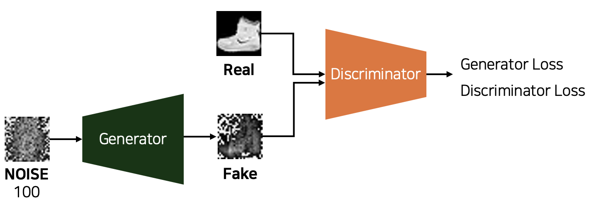

# GANs-Tutorial/Lab1-VanillaGAN

Hi there. 😍 This repository is separated by dataset. The first one is VanillaGAN with FashionMNIST, and the other is VanillaGAN with Korean(related with my graduate research). If you have any question, please contact me. Thank you!  

 
 

## Lab Overview

    

 
 

## Result

VanillaGAN with FashionMNIST  

GIF will be uploaded.

 
 

VanillaGAN with Korean  

    

 
 
 
 
 

    Copyright. 92berra 2024

