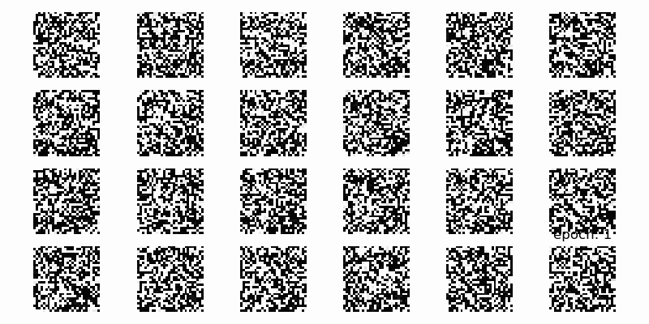

# GANs-Tutorial/Lab1-VanillaGAN

Hi there. 😍 This repository is separated by dataset. The first one is VanillaGAN with FashionMNIST, and the other is VanillaGAN with Korean(related with my graduate research). If you have any question, please contact me. Thank you!  

 
 

## Lab Overview

    

 
 

## Result

VanillaGAN with FashionMNIST  
    

 
 

VanillaGAN with Korean  
    

 
 
 
 
 

    Copyright. 92berra 2024

